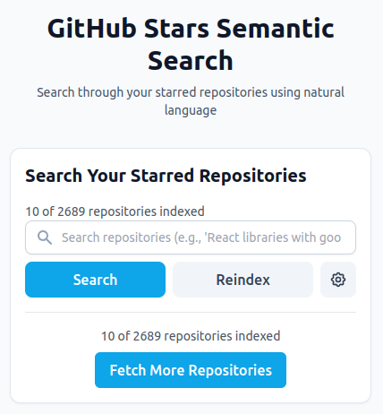

# GitHub Stars Semantic Search

<div align="center">



_Find your GitHub stars easily with natural language search_

**[🚀 Try the Demo](https://luisreinoso.dev/github-starts-semantic-search)**

[Features](#features) • [Installation](#installation) • [Usage](#usage) • [Contributing](#contributing)

</div>

## 🌟 Overview

GitHub Stars Semantic Search is a powerful tool that transforms how you interact with your starred repositories. Using OpenAI's embeddings and PGlite for local storage, it enables natural language search through your GitHub stars, making it easier than ever to find that project you bookmarked months ago.

## ✨ Features

- 🔐 **Secure Authentication**: GitHub personal access token integration
- 🤖 **AI-Powered Search**: Semantic search using OpenAI's advanced embeddings
- 💾 **Local Storage**: Efficient data storage using PGlite
- 🚀 **Fast Indexing**: Efficient processing of starred repositories' README files
- 🎨 **Modern UI**: Clean, responsive interface built with modern web technologies
- 🔒 **Privacy-Focused**: No server-side storage, all data stays on your machine

## 🚀 Demo

Visit the live demo at [luisreinoso.dev/github-starts-semantic-search](https://luisreinoso.dev/github-starts-semantic-search)

## 📋 Prerequisites

- Node.js (v16 or higher)
- GitHub Personal Access Token (with `read:user` scope)
- OpenAI API Key

## 💻 Installation

1. Clone the repository:

```bash
git clone https://github.com/yourusername/github-stars-semantic-search.git
cd github-stars-semantic-search
```

2. Install dependencies:

```bash
pnpm install
```

3. Start the development server:

```bash
pnpm dev
```

## 🎯 Usage

1. **Initial Setup**

   - Enter your GitHub Personal Access Token and OpenAI API Key in the application
   - The app will begin indexing your starred repositories
   - All credentials are stored securely in your browser

2. **Searching**

   - Use natural language queries to search through your stars
   - Example queries:
     - "React components for data visualization"
     - "Machine learning projects in Python"
     - "Authentication libraries for Node.js"

3. **Results**
   - View matching repositories with relevance scores
   - Click on results to visit the original GitHub repository
   - See repository descriptions and other metadata

## 🛠️ Development

```bash
# Start development server
pnpm dev

# Build for production
pnpm build

# Preview production build
pnpm preview

# Run tests
pnpm test
```

## 🔧 Tech Stack

- **Frontend**: TypeScript, Vite, React
- **APIs**: OpenAI API, GitHub API (Octokit)
- **Storage**: PGlite (SQLite in the browser)
- **Styling**: TailwindCSS

## 🔒 Privacy & Security

We take your privacy seriously:

- All data is stored locally in your browser
- No external servers involved except:
  - GitHub API (for fetching starred repositories)
  - OpenAI API (for generating embeddings)
- API keys are stored securely in your browser's local storage

## 🤝 Contributing

Contributions are welcome! Please feel free to submit a Pull Request.

1. Fork the repository
2. Create your feature branch (`git checkout -b feature/AmazingFeature`)
3. Commit your changes (`git commit -m 'Add some AmazingFeature'`)
4. Push to the branch (`git push origin feature/AmazingFeature`)
5. Open a Pull Request

## 📄 License

This project is licensed under the MIT License - see the [LICENSE](LICENSE) file for details.

## 🙏 Acknowledgments

- OpenAI for their powerful embeddings API
- GitHub for their comprehensive API
- The open-source community for inspiration and tools
